# Architecture: Synchronous vs. Asynchronous

Here is the comparison between the previous (Blocking) architecture and the current (Non-Blocking/Async) architecture. This explains why the latency was reduced and throughput increased.

## 1. Previous Architecture (Synchronous / Blocking)
In the previous version, every time the code needed to talk to an external service (OpenAI, Supabase), the **entire server thread stopped and waited**. It could do nothing else until the data came back.

### The Blocking Flow

```mermaid
sequenceDiagram
    participant User
    participant Server as FastAPI Server (Main Thread)
    participant OpenAI
    participant DB as Supabase

    Note over Server: Thread is BUSY
    User->>Server: Request: "What is IVF?"
    
    rect rgb(255, 200, 200)
    Note right of Server: 🛑 BLOCKS here (~2s)
    Server->>OpenAI: Generate Embedding (Sync)
    OpenAI-->>Server: Vector
    end
    
    rect rgb(255, 200, 200)
    Note right of Server: 🛑 BLOCKS here (~3s)
    Server->>DB: Search Documents (Sync HTTP)
    DB-->>Server: Results
    end

    rect rgb(255, 200, 200)
    Note right of Server: 🛑 BLOCKS here (~5-10s)
    Server->>OpenAI: Generate Response (Sync)
    OpenAI-->>Server: Answer
    end

    Server-->>User: Response
    Note over Server: Thread finally FREE
```


**Why it was slow:**
1.  **Serialized Waiting**: If Step A took 2 seconds and Step B took 3 seconds, the total was strictly 5 seconds.
2.  **Resource Hoarding**: While waiting for OpenAI, your CPU was doing nothing, but the thread was "held hostage," preventing it from processing other requests.
3.  **Connection Overhead**: Synchronous libraries often create a new connection for every request instead of reusing a pool efficiently.

---

## 2. Current Architecture (Asynchronous / Non-Blocking)
In the new version, we use `async/await`. When the code needs data from OpenAI, it **pauses only that specific task** and lets the server handle other work (or just wait efficiently) without blocking the thread.

### The Non-Blocking Flow

```mermaid
sequenceDiagram
    participant User
    participant Server as FastAPI Server (Event Loop)
    participant OpenAI
    participant DB as Supabase

    User->>Server: Request: "What is IVF?"
    
    rect rgb(200, 255, 200)
    Note right of Server: 🟢 AWAITS (Thread Free)
    Server->>OpenAI: Async Generate Embedding
    Note over Server: Server can handle other requests now!
    OpenAI-->>Server: Vector
    end
    
    rect rgb(200, 255, 200)
    Note right of Server: 🟢 AWAITS (Thread Free)
    Server->>DB: Async Search Documents
    DB-->>Server: Results
    end

    rect rgb(200, 255, 200)
    Note right of Server: 🟢 AWAITS (Thread Free)
    Server->>OpenAI: Async Generate Response
    OpenAI-->>Server: Answer
    end

    Server-->>User: Response
```


**Why it is faster (avg 15s):**
1.  **Efficient Network Handling**: The `AsyncOpenAI` client (using `httpx`) is highly optimized for network throughput. It manages connections better than standard synchronous requests.
2.  **Concurrency**: If 5 users ask questions at the same time:
    *   **Old**: User 5 waits for User 1, 2, 3, 4 to finish (Queueing).
    *   **New**: All 5 requests are sent to OpenAI almost instantly. The server handles them "at the same time" by juggling the waiting states.

---

## How to Apply This to Other Use Cases

To replicate this performance gain in other features, follow these rules:

### 1. Identify "I/O Bound" Operations
Look for code that communicates with the "outside world":
- Database queries
- API Calls (OpenAI, Twilio, Meta)
- File System reads/writes

### 2. Use Async Libraries
Instead of standard libraries, use their `async` equivalents:
- **Requests** (`requests`) $\rightarrow$ **HTTPX** (`httpx`) or `aiohttp`
- **OpenAI** (`OpenAI()`) $\rightarrow$ **AsyncOpenAI** (`AsyncOpenAI()`)
- **Database** $\rightarrow$ Use async drivers (e.g., `asyncpg` for Postgres) or wrap calls in `asyncio.to_thread`.

### 3. The `await` Keyword
Always `await` the result of these operations. This tells Python: *"Go do something else while this finishes, and come back here when it's done."*

### 4. Parallelize Independent Tasks
If you have two tasks that don't depend on each other (e.g., "Get User Profile" and "Get Daily Tips"), run them together!

**Example Pattern:**
```python
import asyncio

# Bad (Sequential - Takes 2s + 2s = 4s)
# profile = await get_profile()
# tips = await get_tips()

# Good (Parallel - Takes max(2s, 2s) = 2s)
profile_task = get_profile()
tips_task = get_tips()
profile, tips = await asyncio.gather(profile_task, tips_task)
```
