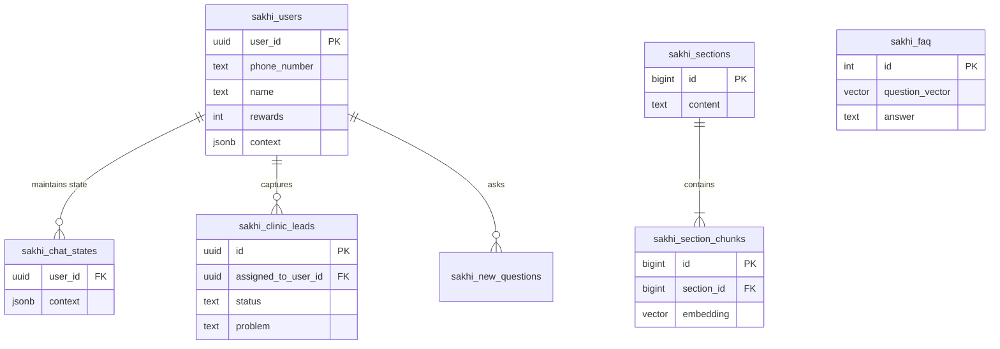

# Sakhi Whatsapp Backend - System Design Document

This document outlines the high-level architecture, database schema, and data flows for the Sakhi Whatsapp Backend.

## 1. High-Level Architecture

The system is designed as a Python-based backend service that interacts with Supabase for data persistence and vector search, and OpenAI for intelligence (LLM and Embeddings). It serves as the brain for a WhatsApp chatbot.

```mermaid
graph TD
    User((WhatsApp User)) <--> WA[WhatsApp Cloud API]
    WA <--> MW[Middleware / Node.js]
    MW <--> BES[Sakhi Backend Service (Python)]
    
    subgraph "Sakhi Backend"
        BES --> RT[Router / API]
        RT --> LM[Lead Manager]
        RT --> RAG[RAG Engine]
        RT --> UP[User Profile Module]
        
        RAG --> OAI[OpenAI API (Embeddings/Chat)]
        LM --> OAI
    end

    subgraph "Supabase (PostgreSQL + pgvector)"
        BES -- Read/Write --> DB[(Database)]
        DB --> USERS[sakhi_users]
        DB --> LEADS[sakhi_clinic_leads]
        DB --> STATE[sakhi_chat_states]
        DB --> VECTORS[Vector Stores]
        
        subgraph "Vector Stores"
            VECTORS --> FAQ[sakhi_faq]
            VECTORS --> KB[sakhi_bot_knowledge]
            VECTORS --> H_RAG[Hierarchical RAG Tables]
        end
    end
```

## 2. Database Schema

The database is hosted on Supabase and utilizes PostgreSQL with the `pgvector` extension for semantic search.

### 2.1 Core User & Leads

#### `sakhi_users`
Stores user profiles and preferences.
| Column | Type | Description |
|---|---|---|
| [user_id](file:///d:/Ottobon/Sakhi-Whatsapp-Backend/supabase_client.py#87-89) | UUID | Primary Key. |
| `name` | TEXT | User's display name. |
| `email` | TEXT | Optional contact email. |
| `phone_number` | TEXT | Normalized phone number (no country code prefix for query). |
| `password_hash` | TEXT | Hashed password (optional/for admin logins). |
| `role` | TEXT | e.g., 'USER', 'ADMIN'. |
| [preferred_language](file:///d:/Ottobon/Sakhi-Whatsapp-Backend/modules/user_profile.py#70-77) | TEXT | e.g., 'en', 'te', 'tinglish'. |
| `relation_to_patient` | TEXT | Relationship context (e.g., 'Self', 'Parent'). |
| `rewards` | INTEGER | User gamification points (default 0). |
| [context](file:///d:/Ottobon/Sakhi-Whatsapp-Backend/modules/rag_search.py#75-97) | JSONB | **Legacy** conversational context (migrating to `sakhi_chat_states`). |
| `gender` | TEXT | User gender. |
| `location` | TEXT | User location. |

#### `sakhi_clinic_leads`
Captures potential patient inquiries from the chat flow.
| Column | Type | Description |
|---|---|---|
| [id](file:///d:/Ottobon/Sakhi-Whatsapp-Backend/supabase_client.py#87-89) | UUID | Primary Key (auto-generated). |
| `name` | TEXT | Patient name. |
| [phone](file:///d:/Ottobon/Sakhi-Whatsapp-Backend/modules/user_profile.py#12-22) | TEXT | Contact number. |
| [age](file:///d:/Ottobon/Sakhi-Whatsapp-Backend/modules/user_profile.py#70-77) | TEXT | Patient age. |
| `gender` | TEXT | Patient gender. |
| `problem` | TEXT | Description of health concern. |
| `status` | TEXT | Status of lead (default 'New Inquiry'). |
| `source` | TEXT | Origin of lead (e.g., 'Whatsapp-Sakhi'). |
| `assigned_to_user_id` | UUID | ID of the user who captured this lead (FK implied). |
| `date_added` | TIMESTAMPTZ | Created timestamp. |

#### `sakhi_chat_states`
Manages ephemeral conversational state to keep the main user table clean.
| Column | Type | Description |
|---|---|---|
| [user_id](file:///d:/Ottobon/Sakhi-Whatsapp-Backend/supabase_client.py#87-89) | UUID | FK -> `sakhi_users.user_id`. |
| [context](file:///d:/Ottobon/Sakhi-Whatsapp-Backend/modules/rag_search.py#75-97) | JSONB | JSON blob storing current conversation step and temp data. |
| `updated_at` | TIMESTAMPTZ | Last update time. |

### 2.2 Knowledge Base & RAG

#### `sakhi_faq`
Stores Frequently Asked Questions and their embeddings.
| Column | Type | Description |
|---|---|---|
| [id](file:///d:/Ottobon/Sakhi-Whatsapp-Backend/supabase_client.py#87-89) | SERIAL | Primary Key. |
| `question` | TEXT | The FAQ question. |
| `answer` | TEXT | The answer text. |
| `youtube_link` | TEXT | Optional educational video link. |
| `infographic_url` | TEXT | Optional image URL. |
| `question_vector` | VECTOR | Embedding of the question for semantic search. |

#### `sakhi_bot_knowledge`
General knowledge base entries (Flat RAG).
| Column | Type | Description |
|---|---|---|
| `title` | TEXT | Title of the knowledge snippet. |
| `content` | TEXT | The knowledge content. |
| [embedding](file:///d:/Ottobon/Sakhi-Whatsapp-Backend/modules/rag_search.py#23-27) | VECTOR | Embedding of the content. |

#### `sakhi_sections` (Hierarchical RAG - Parent)
Stores the full document sections for context retrieval.
| Column | Type | Description |
|---|---|---|
| [id](file:///d:/Ottobon/Sakhi-Whatsapp-Backend/supabase_client.py#87-89) | BIGSERIAL | Primary Key. |
| `header_path` | TEXT | Breadcrumb navigation (e.g., "Fertility > Causes"). |
| `content` | TEXT | Full text content of the section. |
| `token_count` | INT | Token size for context window management. |

#### `sakhi_section_chunks` (Hierarchical RAG - Child)
Stores smaller chunks for granular vector search.
| Column | Type | Description |
|---|---|---|
| [id](file:///d:/Ottobon/Sakhi-Whatsapp-Backend/supabase_client.py#87-89) | BIGSERIAL | Primary Key. |
| `section_id` | BIGINT | FK -> `sakhi_sections.id`. |
| `chunk_content` | TEXT | Small text segment for matching. |
| [embedding](file:///d:/Ottobon/Sakhi-Whatsapp-Backend/modules/rag_search.py#23-27) | VECTOR(1536) | OpenAI embedding of the chunk. |

### 2.3 Analytics & Feedback

#### `sakhi_new_questions`
Logs questions that the bot could not confidently answer.
| Column | Type | Description |
|---|---|---|
| [id](file:///d:/Ottobon/Sakhi-Whatsapp-Backend/supabase_client.py#87-89) | SERIAL | Primary Key. |
| [user_id](file:///d:/Ottobon/Sakhi-Whatsapp-Backend/supabase_client.py#87-89) | TEXT | User identifier. |
| `question` | TEXT | The asker's query. |
| `similarity_score` | FLOAT | The best confidence score achieved (usually low). |
| `created_at` | TIMESTAMPTZ | Timestamp. |

## 3. Entity Relationship Diagram (ERD)



## 4. Key Data Flows

### 4.1 Automated Lead Generation
1.  **Trigger**: User sends `/newlead` command.
2.  **State Init**: System checks `sakhi_chat_states` and initializes [lead_flow](file:///d:/Ottobon/Sakhi-Whatsapp-Backend/modules/lead_manager.py#44-142) step `ask_name`.
3.  **Interaction**: User responds to prompts (Name -> Phone -> Age -> Gender -> Problem).
4.  **State Update**: Each step updates `sakhi_chat_states.context` with accumulating data.
5.  **Completion**: On final step, data is written to `sakhi_clinic_leads` and chat state is cleared.

### 4.2 RAG (Retrieval-Augmented Generation) Response
1.  **Query**: User asks a medical question.
2.  **Embedding**: [rag_search.py](file:///d:/Ottobon/Sakhi-Whatsapp-Backend/modules/rag_search.py) generates an embedding for the query using OpenAI.
3.  **Search**:
    *   **FAQ Match**: Queries `sakhi_faq` via `match_faq` RPC.
    *   **KB Match**: Queries `sakhi_bot_knowledge` via `match_sakhi_kb`.
    *   **Hierarchical Match**: Queries `sakhi_section_chunks` -> joins `sakhi_sections` via `hierarchical_search`.
4.  **Ranking**: Results are merged and sorted by similarity score.
5.  **Generation**: Top results are fed into the LLM system prompt to generate a natural language answer.
